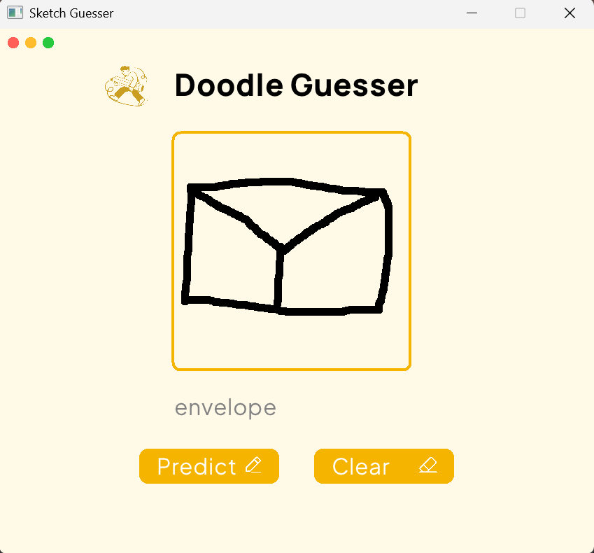

# Doodle Guesser

A real-time hand-drawn sketch recognition system powered by a **Convolutional Neural Network built from scratch in C++17**.
Draw a sketch on the canvas and the model classifies it into one of six categories:

**cup · donut · envelope · house · guitar · pants**

The project was built to understand the fundamentals of neural networks by implementing the CNN training and inference pipeline without external machine learning frameworks.



## Tech Stack

- **C++17** — CNN and application
- **Eigen** — matrix and vector operations
- **Raylib** — drawing canvas and GUI
- **OpenCV** — image preprocessing
- **Python + NumPy** — offline dataset preparation
- **CMake** — build system

## Features

- CNN implemented from scratch
- Forward pass and backpropagation
- Categorical cross-entropy loss
- SGD optimization
- Numerical gradient checking
- Real-time sketch drawing and prediction
- Binary model serialization
- Automatic best-model checkpointing
- Unit and gradient-check tests

## Model Architecture

```text
Input: 1×28×28 grayscale image
        ↓
Conv2D: 4 filters, 3×3
        ↓
ReLU
        ↓
MaxPool: 2×2
        ↓
Flatten: 676
        ↓
FC: 676 → 32
        ↓
ReLU
        ↓
FC: 32 → 6
        ↓
Softmax
        ↓
Predicted class
```

**Total: 21,902 trainable parameters**

## Pipeline

### Training

```text
Quick Draw Dataset
        ↓
Python preprocessing
        ↓
dataset.bin
        ↓
C++ CNN training
        ↓
Saved model
```

### Prediction

```text
Raylib Canvas
        ↓
OpenCV preprocessing
        ↓
CNN forward pass
        ↓
Predicted class
```

## Results

Training was performed on an **80/20 train-validation split**:

- 4,800 training images
- 1,200 validation images
- ~100% training accuracy
- **~94% validation accuracy**

[View Training Curves](https://github.com/rituuu001/Doodle-guesser/blob/main/docs/cnntraining_and_validationaccuracy.png)

## Requirements

- C++17 compiler
- CMake 3.20+
- OpenCV 4.x
- Python 3.x + NumPy *(only for dataset preparation)*

Eigen and Raylib are included as git submodules.

## Build

Clone the repository with its submodules:

```bash
git clone --recurse-submodules https://github.com/rituuu001/Doodle-guesser.git
cd Doodle-guesser
```

If the repository was already cloned without submodules:

```bash
git submodule update --init --recursive
```

Install OpenCV 4.x, then configure and build:

```bash
mkdir build
cd build
cmake .. -DCMAKE_BUILD_TYPE=Release
cmake --build .
```

## Run

A pre-trained model is included, so training is optional.

### Run the application

```bash
cmake --build . --target run_predict
```

### Train the model

Prepare the dataset:

```bash
python3 scripts/preprocess/download_quickdraw.py
python3 scripts/preprocess/pack_dataset.py
```

Then train:

```bash
cmake --build . --target run_train
```

### Run tests

```bash
cmake --build . --target run_tests
```

## Project Structure

```text
Doodle-guesser/
├── include/sketchguesser/    # CNN headers and core components
├── src/                      # CNN implementation and training
├── gui/                      # Raylib UI and canvas
├── tests/                    # Unit and gradient-check tests
├── scripts/preprocess/       # Dataset preparation
├── data/                     # Dataset files
├── models/                   # Saved model weights
├── libraries/                # Eigen and Raylib submodules
└── CMakeLists.txt
```

## Future Improvements

- Mini-batch gradient descent
- Adam/RMSProp optimizers
- Data augmentation
- Confusion matrix and per-class metrics
- More sketch categories
- GPU/SIMD acceleration

## References

- [Quick, Draw! Dataset](https://github.com/googlecreativelab/quickdraw-dataset)
- [Raylib](https://www.raylib.com/)
- [OpenCV](https://opencv.org/)
- [Eigen](https://eigen.tuxfamily.org/)
